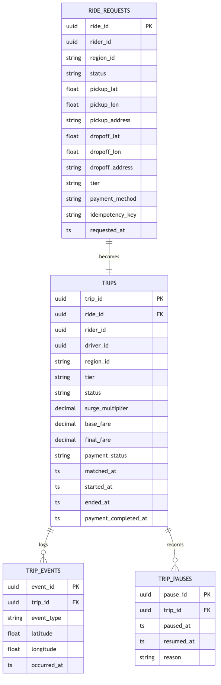
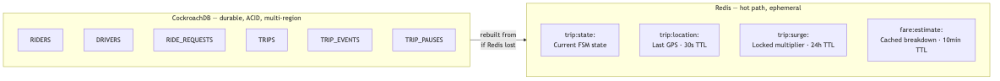

# D4 — Entity Relationship Diagram: Trip Service

---

## Entity Relationship Diagram



---

## Storage Architecture



> CockroachDB holds all financial records with ACID guarantees.
> Redis holds live state for sub-millisecond reads on the hot path.
> If Redis is lost the FSM state is rebuilt from Postgres on next access.

---

## Relationship Descriptions

| Relationship | Cardinality | Meaning |
|---|---|---|
| Ride Request → Trip | One-to-one | A matched ride request becomes exactly one trip |
| Rider → Trips | One rider, many trips | A rider accumulates trips over time |
| Driver → Trips | One driver, many trips | A driver completes many trips over time |
| Trip → Trip Events | One trip, many events | Every FSM state transition is logged with GPS coordinates |
| Trip → Trip Pauses | One trip, many pauses | A trip can be paused and resumed multiple times before completion |

---

## Field Notes

**`trip_id` vs `ride_id`**: A `RIDE_REQUEST` records intent to book. A `TRIP` records the fulfilled journey including fare, GPS trace, and payment outcome. The unique constraint on `ride_id` inside `TRIPS` ensures no ride request can accidentally become two trips.

**`status` on TRIPS**

| Value | Meaning |
|---|---|
| `MATCHED` | Driver accepted; trip not yet started by driver |
| `IN_PROGRESS` | Driver is driving the rider to the destination |
| `PAUSED` | Trip temporarily paused (traffic, breakdown, etc.) |
| `COMPLETED` | Trip ended normally at the destination |
| `CANCELLED` | Trip was cancelled by rider or driver |}

**`payment_status` on TRIPS**: Updated by the Trip Service itself when it consumes a `payment.completed` or `payment.failed` event from Kafka. Trip Service is the sole writer of the `trips` table (see trade-off #11). Reconciliation jobs use this field to detect failed or stuck payments. `REFUNDED` is set when a completed payment is reversed (e.g. disputed ride).

**`TRIP_EVENTS` as FSM audit log**: Every state transition is written here with GPS coordinates and timestamp — useful for dispute resolution and fraud detection. `MATCHED` is the first event, written at trip creation so the full timeline is queryable from this table alone.

**`reason` on TRIP_PAUSES**

| Value | Meaning |
|---|---|
| `TRAFFIC` | Stopped due to heavy traffic |
| `BREAKDOWN` | Vehicle breakdown |
| `REQUESTED_BY_RIDER` | Rider asked driver to stop |
| `OTHER` | Any other reason |

---

## SQL Schema

```sql
-- Trips (partitioned by region_id for multi-region isolation)
CREATE TABLE trips (
    trip_id                UUID              PRIMARY KEY DEFAULT gen_random_uuid(),
    ride_id                UUID              NOT NULL,
    rider_id               UUID              NOT NULL,
    driver_id              UUID              NOT NULL,
    region_id              VARCHAR(32)       NOT NULL,
    tier                   VARCHAR(16)       NOT NULL
                                             CHECK (tier IN ('AUTO','STANDARD','PREMIUM')),
    payment_method         VARCHAR(16)       NOT NULL
                                             CHECK (payment_method IN ('UPI','CARD','CASH','WALLET')),
    status                 VARCHAR(16)       NOT NULL DEFAULT 'MATCHED'
                                             CHECK (status IN ('MATCHED','IN_PROGRESS','PAUSED','COMPLETED','CANCELLED')),
    matched_at             TIMESTAMPTZ       NOT NULL DEFAULT now(),   -- when match was confirmed
    started_at             TIMESTAMPTZ,                                -- set when driver starts trip
    ended_at               TIMESTAMPTZ,
    distance_km            DOUBLE PRECISION,                           -- set when trip ends; needed for receipt
    base_fare              DECIMAL(10,2)     NOT NULL DEFAULT 0.00,
    surge_multiplier       DECIMAL(4,2)      NOT NULL DEFAULT 1.00,
    final_fare             DECIMAL(10,2)     NOT NULL DEFAULT 0.00,
    payment_status         VARCHAR(16)       NOT NULL DEFAULT 'PENDING'
                                             CHECK (payment_status IN ('PENDING','COMPLETED','FAILED','REFUNDED')),
    payment_id             VARCHAR(64),                                -- set when payment.completed consumed; needed for receipt
    payment_psp_reference  VARCHAR(128),                               -- PSP transaction ref; needed for receipt
    payment_completed_at   TIMESTAMPTZ,
    version                INT               NOT NULL DEFAULT 0,       -- optimistic locking (incremented on every UPDATE)
    CONSTRAINT unique_trip_ride_id UNIQUE (ride_id)
) PARTITION BY LIST (region_id);

CREATE INDEX idx_trips_rider_id   ON trips (rider_id);
CREATE INDEX idx_trips_driver_id  ON trips (driver_id);
CREATE INDEX idx_trips_open       ON trips (status) WHERE status = 'IN_PROGRESS';

-- Trip Events (append-only FSM audit log)
CREATE TABLE trip_events (
    event_id     UUID              PRIMARY KEY DEFAULT gen_random_uuid(),
    trip_id      UUID              NOT NULL REFERENCES trips (trip_id),
    event_type   VARCHAR(16)       NOT NULL
                                   CHECK (event_type IN ('MATCHED','STARTED','ARRIVED','PAUSED','RESUMED','COMPLETED','CANCELLED')),
    latitude     DOUBLE PRECISION,
    longitude    DOUBLE PRECISION,
    occurred_at  TIMESTAMPTZ       NOT NULL DEFAULT now()
);

CREATE INDEX idx_trip_events_trip_id     ON trip_events (trip_id);
CREATE INDEX idx_trip_events_occurred_at ON trip_events (occurred_at DESC);

-- Trip Pauses
CREATE TABLE trip_pauses (
    pause_id    UUID         PRIMARY KEY DEFAULT gen_random_uuid(),
    trip_id     UUID         NOT NULL REFERENCES trips (trip_id),
    paused_at   TIMESTAMPTZ  NOT NULL DEFAULT now(),
    resumed_at  TIMESTAMPTZ,
    reason      VARCHAR(32)  NOT NULL
                             CHECK (reason IN ('TRAFFIC','BREAKDOWN','REQUESTED_BY_RIDER','OTHER'))
);

CREATE INDEX idx_trip_pauses_trip_id ON trip_pauses (trip_id);

-- Ride Requests (persisted by Dispatch Service; Trip Service references ride_id)
CREATE TABLE ride_requests (
    ride_id          UUID              PRIMARY KEY DEFAULT gen_random_uuid(),
    rider_id         UUID              NOT NULL,
    region_id        VARCHAR(32)       NOT NULL,
    status           VARCHAR(16)       NOT NULL DEFAULT 'REQUESTED'
                                       CHECK (status IN ('REQUESTED','MATCHED','NO_DRIVER','CANCELLED')),
    pickup_lat       DOUBLE PRECISION  NOT NULL,
    pickup_lon       DOUBLE PRECISION  NOT NULL,
    pickup_address   VARCHAR(256),
    dropoff_lat      DOUBLE PRECISION  NOT NULL,
    dropoff_lon      DOUBLE PRECISION  NOT NULL,
    dropoff_address  VARCHAR(256),
    tier             VARCHAR(16)       NOT NULL
                                       CHECK (tier IN ('STANDARD','PREMIUM','AUTO')),
    payment_method   VARCHAR(16)       NOT NULL
                                       CHECK (payment_method IN ('UPI','CARD','CASH','WALLET')),
    idempotency_key  VARCHAR(64)       NOT NULL,
    requested_at     TIMESTAMPTZ       NOT NULL DEFAULT now(),
    CONSTRAINT unique_ride_idempotency_key UNIQUE (idempotency_key)
);

CREATE INDEX idx_ride_requests_rider_id ON ride_requests (rider_id);
CREATE INDEX idx_ride_requests_status   ON ride_requests (status) WHERE status = 'REQUESTED';
```

---

## Redis Key Schema (Hot Path)

| Key Pattern | Type | Contents | Expiry |
|---|---|---|---|
| `trip:state:<tripId>` | String | Current FSM state: `MATCHED` / `IN_PROGRESS` / `PAUSED` — **key is deleted (not set) when trip reaches `COMPLETED` or `CANCELLED`** | None — deleted explicitly when trip closes |
| `trip:surge:<tripId>` | String | Surge multiplier locked at match confirmation (e.g. `"1.3"`) | **24 h** — also deleted explicitly when trip closes |
| `trip:location:<tripId>` | Hash | `lat`, `lon`, `updatedAt` — last known driver GPS position | 30 seconds |
| `driver:current-trip:<driverId>` | String | `tripId` | None — cleared when trip closes |
| `fare:estimate:<rideId>` | String | JSON fare breakdown cached at ride-request time | 10 minutes |
