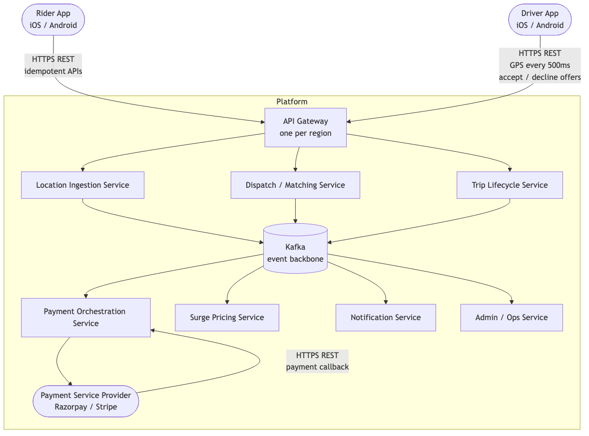
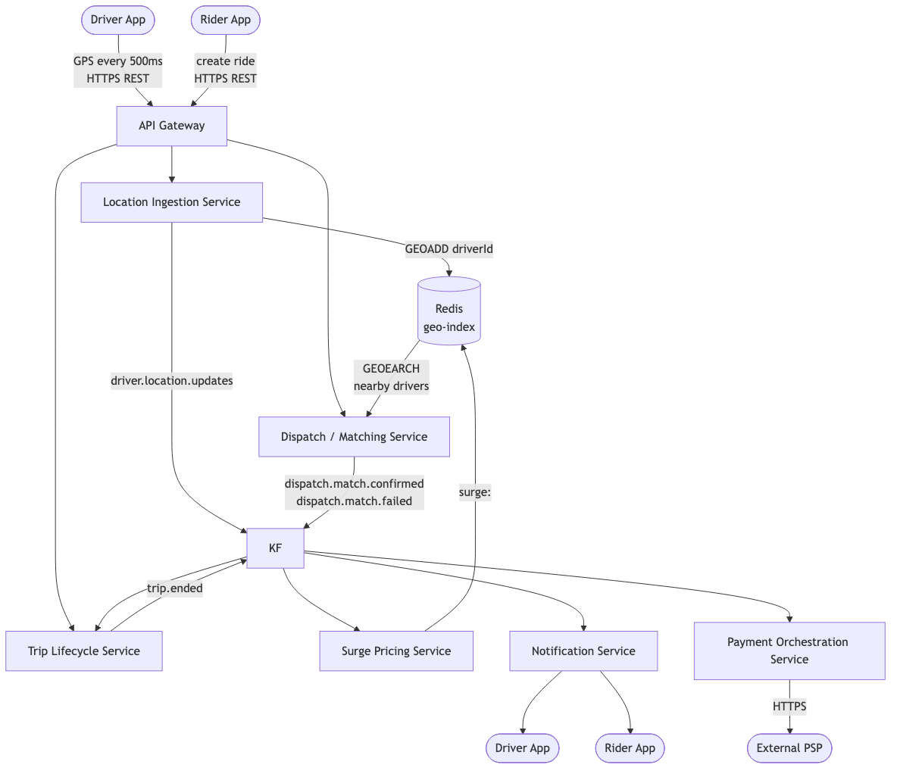

# HLD — 01: System Context and Components

---

## System Context

This diagram shows every external actor that communicates with the platform, and what protocol they use.

---

## Service Descriptions

Each service owns one concern.

---

### 1. API Gateway

Handles all inbound traffic from the Rider App and Driver App.

- Terminate HTTPS / TLS at the edge
- Validate JWT tokens — reject unauthenticated requests
- Apply rate limits per driver (max 2 location updates/second)
- Validate that mutating requests carry an Idempotency-Key
- Route `/rides`, `/trips` → downstream services
- One instance deployed per region (no cross-region routing)

---

### 2. Location Ingestion Service

FR-1 — real-time driver location ingestion.

- Accept up to 2 GPS coordinate updates per second per driver (rate-limited at API Gateway)
- Write the driver’s position into a Redis Geo Sorted Set: `GEOADD drivers:<regionId> <lon> <lat> <driverId>`
  - Redis encodes `(lon, lat)` as a 52-bit Geohash score using a Z-order space-filling curve
  - `GEOADD` atomically overwrites the old position — this is what Dispatch queries with `GEOEARCH`
- Publish a location-update event to Kafka so Surge Pricing can map the coordinate to an H3 hex cell and update supply count
- Stateless — scales horizontally without coordination

---

### 3. Dispatch / Matching Service

FR-3 — assign driver within < 1 s (p95); reassign on decline or timeout.

- Receive a ride request from Kafka
- Read the current surge multiplier from Redis
- Query the Redis geo-index for drivers within pickup radius
- Filter to drivers who are available (IDLE) and match tier
- Rank filtered candidates by proximity and rating
- Send a timed offer to the top candidate (10-second window)
- On acceptance → emit `dispatch.match.confirmed` to Kafka
- On decline or timeout → send offer to next candidate
- If no driver accepts within 30 seconds → emit `dispatch.match.failed`
- **At ride request time**: compute an upfront fare estimate and cache it under `fare:estimate:<rideId>` in Redis (TTL 10 min) so the Rider App can display a price range before a driver is matched. This key is read by the Rider App via the `GET /v1/rides/{rideId}` poll response.

---

### 4. Surge Pricing Service

FR-4 — dynamic surge pricing per geo-cell.

- Consume driver location events from Kafka
- Map each driver position to an H3 hexagonal geo-cell (resolution 8, ~460 m edge)
- Track the count of available drivers per cell (supply)
- Track the count of open ride requests per cell (demand)
- Every 5 seconds, compute the surge multiplier for each cell using a log-curve formula capped at 3.0
- Write the multiplier to Redis with a 60-second expiry
- Snapshot multiplier values to Postgres every 60 seconds for analytics and dispute resolution

---

### 5. Trip Lifecycle Service

FR-5 — trip start, pause, end, fare calculation, receipts.

- Create a trip record when a dispatch match is confirmed
- Manage state transitions: `MATCHED → IN_PROGRESS → PAUSED → COMPLETED / CANCELLED`
- Accept a `POST /trips/{id}/arrive` signal from the driver (non-FSM-changing) to publish a `DRIVER_ARRIVED` notification — this is the trigger for the `DRIVER_ARRIVED` push template
- Lock the surge multiplier at match confirmation time so it cannot change mid-trip
- Record each pause window in `trip_pauses` table
- On trip end: calculate fare from distance, time, and surge multiplier. **`distanceKm` is currently supplied by the driver app; a future improvement is server-side computation from the GPS trace in `trip_events`/`trip:location` to prevent manipulation.**
- Trigger payment by publishing `trip.ended` event to Kafka
- Consume `payment.completed` events from Kafka: update `trips.payment_status = COMPLETED` and store `payment_id` + `payment_psp_reference` (required for `GET /receipt`). Consume `payment.failed`: update `trips.payment_status = FAILED`. Trip Service is the sole writer of the `trips` table.
- **Dependency:** the `trip:location:<tripId>` Redis key (live driver GPS position during a trip) is written by the Location Ingestion Service, not this service. It requires the Location Ingestion Service to be aware of active trips (via `driver:current-trip:<driverId>`).

---

### 6. Payment Orchestration Service

FR-6 — PSP integration, retries, reconciliation.

- Consume the `trip.ended` event from Kafka
- Create a payment record in Postgres with a unique idempotency key so duplicate events are safely ignored
- Call the external Payment Service Provider over HTTPS
- On success → mark payment `COMPLETED`, emit `payment.completed`
- On failure → retry with exponential backoff (max 3 attempts)
- On PSP timeout → keep status `PENDING`, scheduled async retry
- After all retries exhausted → route to dead-letter queue and alert the operations team
- Run a nightly reconciliation job against PSP statements

---

### 7. Notification Service

FR-7 — push and SMS notifications for key ride state changes.

- Consume `notification.requested` events from Kafka
- Select the correct template based on event type (`RIDE_MATCHED`, `DRIVER_ARRIVED`, `TRIP_COMPLETED`, etc.)
- Send push notifications via FCM (Android) and APNs (iOS)
- Send SMS via a telecom gateway for critical states (no-driver-available, payment confirmation)
- Fire-and-forget: failures are retried internally; notification delivery does not block any other service

---

### 8. Admin / Ops Service

FR-8 — feature flags, kill-switches, observability.

- Manage feature flags to enable/disable features per region or per percentage of traffic without a deployment
- Expose kill-switch endpoints to immediately disable a service in case of a production incident
- Serve runtime configuration values to other services
- Provide observability dashboards: dispatch p95 latency vs SLO, offer acceptance rate, location consumer lag, payment success rate

---

## Service Dependency Map

