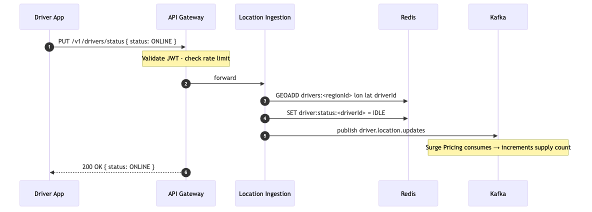
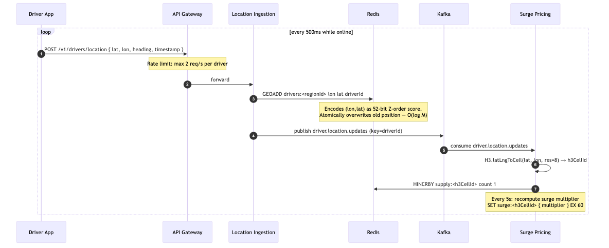
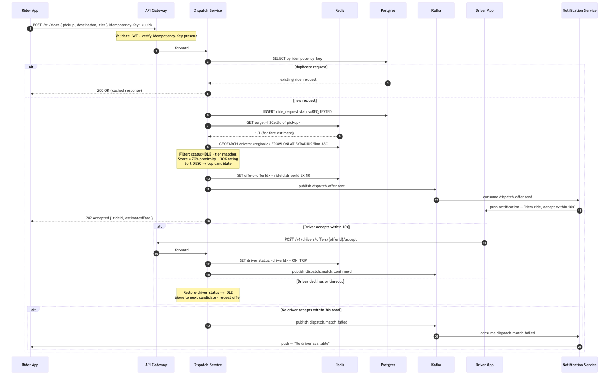
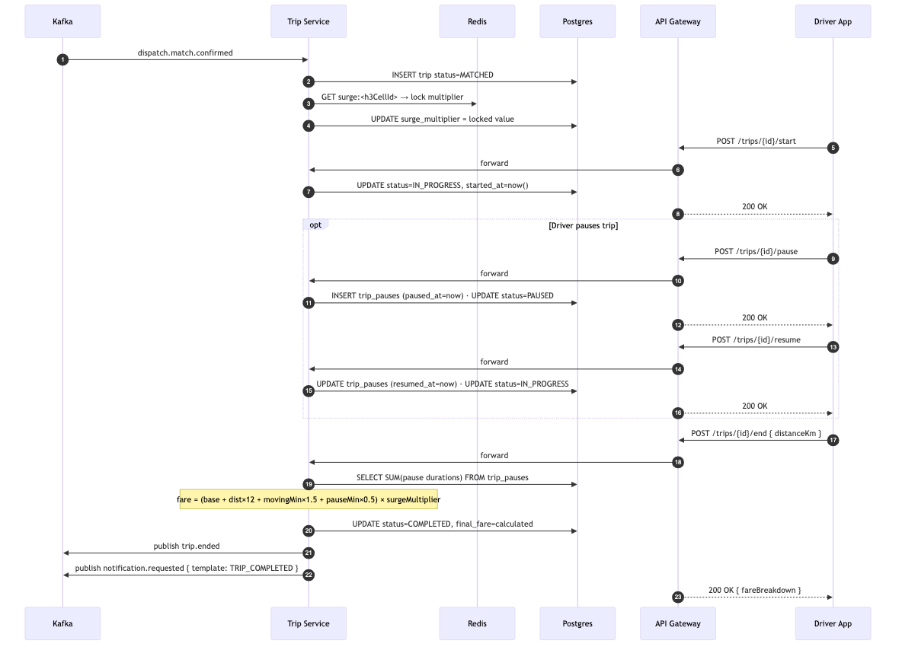
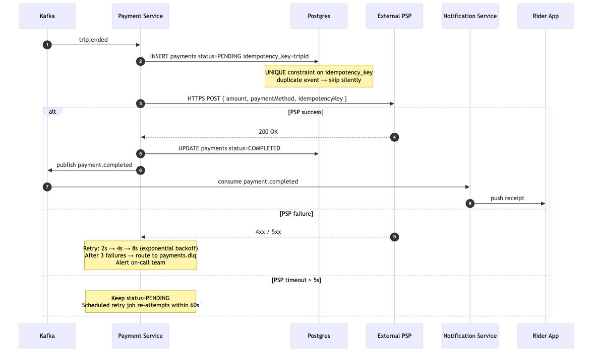
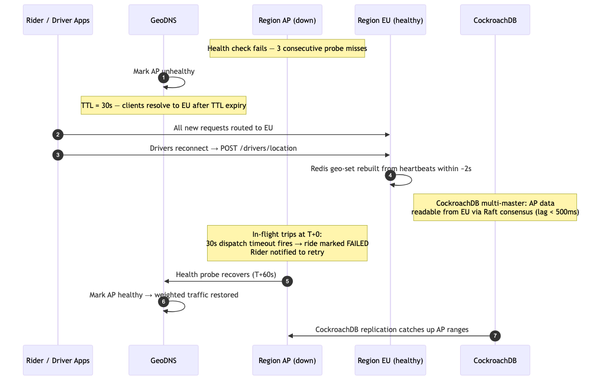

# HLD — 02: Data Flow

Each flow below describes one end-to-end journey through the platform, with a step-by-step sequence diagram.

---

## Flow 1 — Driver Goes Online

**Trigger:** Driver opens the app and taps "Go Online".

---

## Flow 2 — Driver Location Heartbeat (500,000 updates per second globally)

**Trigger:** Driver app sends GPS coordinates every 500 milliseconds while online.

> **Note:** The Redis Geo Sorted Set stores driver positions as 52-bit Z-order (Hilbert-like) encoded scores, enabling O(log M) radius queries via `GEOEARCH`. H3 hex cells are used separately by the Surge Pricing Service for area-level supply/demand aggregation — not for proximity search.

---

## Flow 3 — Rider Creates a Ride Request → Dispatch → Driver Match

**Trigger:** Rider taps "Book Ride" in the app.

---

## Flow 4 — Trip Lifecycle (from Match to Completion)

**Trigger:** `dispatch.match.confirmed` event arrives on Kafka.

---

## Flow 5 — Payment

**Trigger:** `trip.ended` event arrives on Kafka.

---

## Flow 6 — Region Failover

**Trigger:** A deployment region goes down (hardware failure, network partition, etc.).

