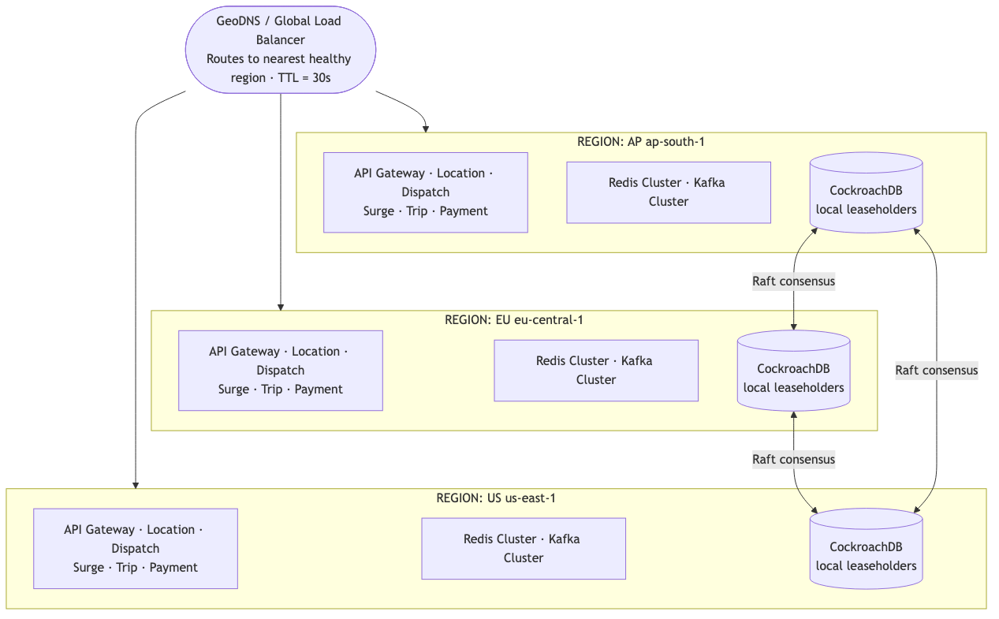
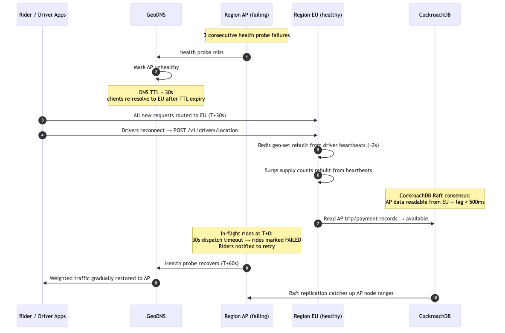

# HLD — 05: Multi-Region Topology

## Region Layout

---

## Rules

| Rule | Detail |
|---|---|
| **Region-local writes** | All ride, location, trip, payment writes go to the local region only. No cross-region writes on hot path. |
| **No cross-region sync on hot path** | Dispatch reads from local Redis and local CockroachDB only. A ride in AP never touches EU stores during normal operation. |
| **CockroachDB consensus** | Multi-region CockroachDB replicates data across regions for durability. Writes commit to local leaseholder; replicated asynchronously to others. |
| **Global reference data** | `drivers` table is global (replicated, no leaseholder preference) — readable from any region at slight staleness. |
| **Redis is region-local only** | No Redis replication across regions. On failover, Redis is re-hydrated from driver heartbeats within seconds. |
| **Kafka is region-local only** | No cross-region Kafka consumer. Each region's services consume their own cluster. |

---

## Failover Sequence

---

## Active–Active vs Active–Passive Decision

| Service | Mode | Reason |
|---|---|---|
| Location Ingestion | **Active–Active** | Stateless; each region handles its own drivers |
| Dispatch | **Active–Active** | Stateless; each region dispatches its own rides |
| Surge Pricing | **Active–Active** | Each region computes surge for its own cells |
| Trip Lifecycle | **Active–Active** | Trips are region-scoped; CockroachDB provides ACID locally |
| Payment | **Active–Active** | Idempotency key prevents double-charge even if retried in different region |
| CockroachDB | **Active–Active** | Multi-region consensus; each region owns its leaseholders |
| Redis | **Active–local** | Pure local; no cross-region replication (by design) |
| Kafka | **Active–local** | Pure local; no cross-region mirroring |
