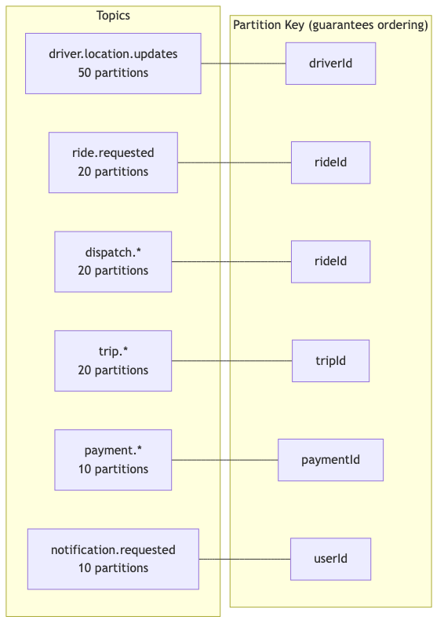

# HLD — 03: Scaling

## Scale Numbers (from problem statement)

| Metric | Volume | Implication |
|---|---|---|
| Concurrent drivers globally | 300 k | Redis geo-set: ~3 GB (10 bytes/entry × 300k) |
| Location updates/s globally | 500 k | ~50 Kafka partitions needed |
| Ride requests/min peak | 60 k | 1,000 req/s → Dispatch workers: 10–20 replicas |
| Dispatch SLO | p95 ≤ 1 s | End-to-end: Redis read + rank + offer push |

---

## Partition Strategy — Kafka

> **Math:** 500,000 events/s ÷ 10,000 events/s per partition = **50 partitions** for `driver.location.updates`

---

## Scaling Per Service

### Location Ingestion Service

**Bottleneck:** 500k writes/s to Redis

- Stateless HTTP service — scale horizontally
- Redis Cluster with 6+ shards (geo-set partitioned by `regionId` key prefix)
- Kafka producer batching: `linger.ms=5`, `batch.size=65536`
- Each service instance handles one Kafka partition → linear scale

### Dispatch / Matching Service

**Bottleneck:** Redis `GEOEARCH` latency + offer round-trip within 1s p95

- Stateless workers — one worker per Kafka partition (`ride.requested`)
- `GEOEARCH` is O(N + log M): for 5km radius in a dense city ~200 candidates → negligible latency
- Virtual thread per offer await (Java 21) → no thread-pool exhaustion
- Pre-filter: only IDLE drivers in geo-set; ON_TRIP drivers are removed on match

### Surge Pricing Service

**Bottleneck:** None — lightweight compute, infrequent writes

- 1 consumer group, ~5 partitions on location topic
- Scheduled recompute every 5s per active cell
- Active cells = cells with any driver or ride request in last 60s
- `SCAN supply:*` to find active cells; total active cells globally ~50k max

### Trip Lifecycle Service

**Bottleneck:** DB write contention on trip state updates

- Optimistic locking (version column) on `trips` table
- CockroachDB partitioned by `region_id` → writes stay local
- Stateless workers; Kafka partitioned by `tripId` → same partition handles all events for a trip

### Payment Orchestration Service

**Bottleneck:** PSP latency (external, uncontrolled)

- Async: `trip.ended` triggers payment asynchronously — PSP latency never blocks trip-end API
- PSP call on virtual thread with 5s timeout
- Idempotency: unique DB constraint on `idempotency_key` prevents double charge
- Retry scheduler: polls `PENDING` payments older than 30s, retries up to 3 times

---

## Auto-scaling Triggers

| Service | Trigger | Action |
|---|---|---|
| Location Ingestion | Kafka consumer lag > 10k events | +2 replicas |
| Dispatch | Kafka consumer lag > 500 events | +2 replicas |
| Trip | Kafka consumer lag > 200 events | +1 replica |
| Payment | Kafka consumer lag > 100 events | +1 replica |
| All | CPU > 75% for 2 min | +1 replica |
