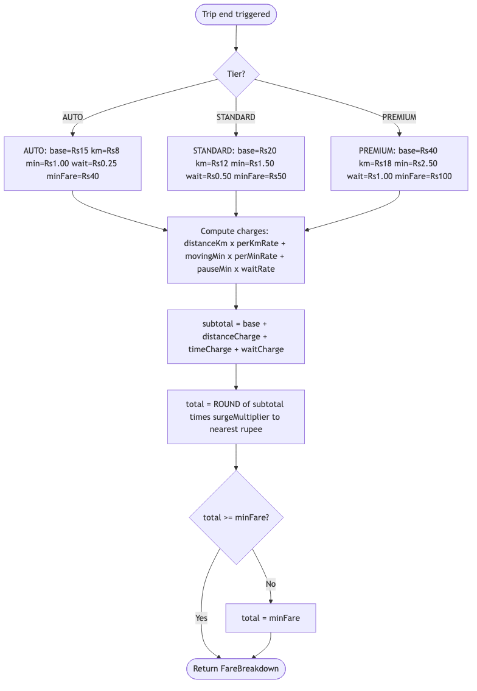
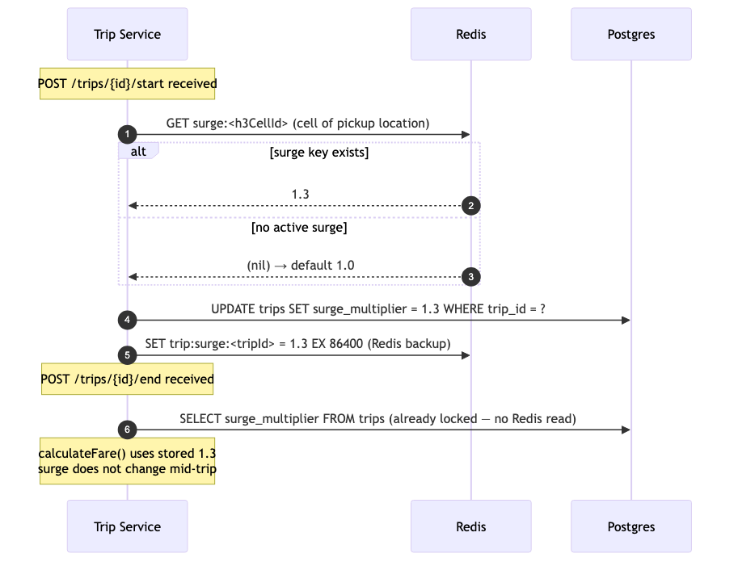

# LLD Trip — 02: Fare Calculation

## Formula

```
Total Fare = (baseFare
           + distanceKm   × perKmRate
           + durationMin  × perMinuteRate
           + pauseMin     × waitRate)
           × surgeMultiplier

subject to: tier-based minimum fare
            (AUTO = ₹40 / STANDARD = ₹50 / PREMIUM = ₹100)

Where:
  durationMin = (endedAt - startedAt).toMinutes() - pauseMin
  pauseMin    = sum of all (resumedAt - pausedAt) for this trip
  surgeMultiplier = value locked in Redis at MATCH CONFIRMATION (not at trip start or end)
  perKmRate, perMinuteRate, waitRate, baseFare = loaded from tier RateConfig
```



## Rate Config (per tier)

Rates differ per `RideTier`. All values are defaults — loaded from feature-flag / config service in production.

| Parameter | AUTO | STANDARD | PREMIUM | Notes |
|---|---|---|---|---|
| `base_fare` | ₹15 | ₹20 | ₹40 | Applied once per trip |
| `per_km_rate` | ₹8 / km | ₹12 / km | ₹18 / km | Applied to total distance |
| `per_minute_rate` | ₹1.00 / min | ₹1.50 / min | ₹2.50 / min | Moving time only (excl. pause) |
| `wait_rate` | ₹0.25 / min | ₹0.50 / min | ₹1.00 / min | Applied to pause duration |
| `min_fare` | ₹40 | ₹50 | ₹100 | Floor regardless of distance |
| `surge_cap` | 3.0× | 3.0× | 3.0× | Maximum multiplier (enforced by Surge Pricing) |

## Worked Example (STANDARD tier)

```
Trip details:
  tier          = STANDARD
  distance      = 8.4 km
  started_at    = 10:35:00
  paused_at     = 10:42:00, resumed_at = 10:45:00  (3 min pause)
  ended_at      = 10:55:00
  surge         = 1.3 (locked at match confirmation)

Calculation:
  total elapsed  = 10:55 - 10:35 = 20 min
  pause          = 10:45 - 10:42 = 3 min
  moving time    = 20 - 3        = 17 min

  base           = ₹20.00
  distance       = 8.4 × ₹12    = ₹100.80
  moving time    = 17 × ₹1.50   = ₹25.50
  wait           = 3  × ₹0.50   = ₹1.50
  ─────────────────────────────────────────
  subtotal       = ₹147.80
  × surge 1.3    = ₹192.14
  rounded        = ₹192.00   (round to nearest rupee)
  final fare     = max(₹192.00, ₹50) = ₹192.00
```

## Fare Breakdown Object

```java
public record FareBreakdown(
    BigDecimal base,
    BigDecimal distanceCharge,
    BigDecimal timeCharge,
    BigDecimal waitCharge,
    BigDecimal surgeMultiplier,
    BigDecimal subtotal,
    BigDecimal total,
    String currency
) {}
```

## Cancellation Fee Schedule

Charged when a rider or driver cancels a trip that is already `IN_PROGRESS` or `PAUSED`.
No fee is charged for `MATCHED` state cancellations (driver has not yet started).

| Tier | Fee (flat) | Applied when |
|---|---|---|
| AUTO | ₹20 | Trip `IN_PROGRESS` or `PAUSED` |
| STANDARD | ₹30 | Trip `IN_PROGRESS` or `PAUSED` |
| PREMIUM | ₹50 | Trip `IN_PROGRESS` or `PAUSED` |

Rates are loaded from feature-flag / config service in production; defaults above are used when config is unavailable.
The fee is published to `payment.initiated` with idempotency key `cancel-fee-<tripId>` to prevent double charge on retries.

## Surge Multiplier Locking


