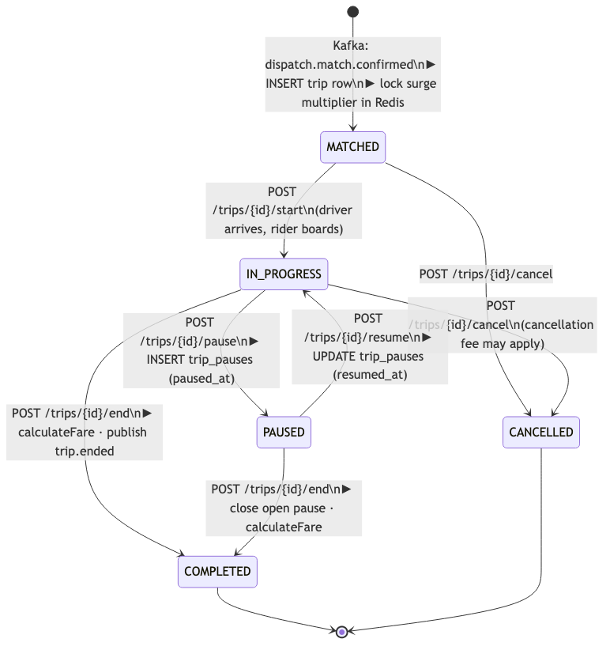

# LLD Trip — 01: Finite State Machine

## Trip States

## Transition Table

| From | Trigger | To | Side Effects |
|---|---|---|---|
| _(none)_ | `dispatch.match.confirmed` consumed | `MATCHED` | INSERT trip row; `SET trip:surge:<tripId>` (lock multiplier); INSERT `trip_events(MATCHED)` (audit trail starts here); publish `notification.requested` (`RIDE_MATCHED` template) |
| `MATCHED` | `POST /trips/{id}/arrive` | `MATCHED` _(no state change)_ | Audit `ARRIVED` event; publish `notification.requested` (`DRIVER_ARRIVED` template) to notify rider of driver's physical arrival |
| `MATCHED` | `POST /trips/{id}/start` | `IN_PROGRESS` | UPDATE `started_at`; SET `driver:current-trip:<driverId>`; INSERT `trip_events(STARTED)`; publish `trip.started`; publish `notification.requested` (`TRIP_STARTED` template) |
| `IN_PROGRESS` | `POST /trips/{id}/pause` | `PAUSED` | INSERT `trip_pauses (paused_at=now)` |
| `PAUSED` | `POST /trips/{id}/resume` | `IN_PROGRESS` | UPDATE `trip_pauses (resumed_at=now)` |
| `IN_PROGRESS` | `POST /trips/{id}/end` | `COMPLETED` | Calculate fare; UPDATE trip row; publish `trip.ended`; publish `notification.requested` |
| `PAUSED` | `POST /trips/{id}/end` | `COMPLETED` | Close open pause; calculate fare; same as above |
| `MATCHED` | `POST /trips/{id}/cancel` | `CANCELLED` | UPDATE status; publish `notification.requested` |
| `IN_PROGRESS` | `POST /trips/{id}/cancel` | `CANCELLED` | UPDATE status; publish `payment.initiated` (cancellation fee); publish `notification.requested` |
| `PAUSED` | `POST /trips/{id}/cancel` | `CANCELLED` | Close open pause; UPDATE status; publish `payment.initiated` (cancellation fee); publish `notification.requested` |

## Invalid Transitions (throw `InvalidTripStateException`)

- `COMPLETED` → any
- `CANCELLED` → any
- `PAUSED` → `MATCHED`
- `IN_PROGRESS` → `MATCHED`
