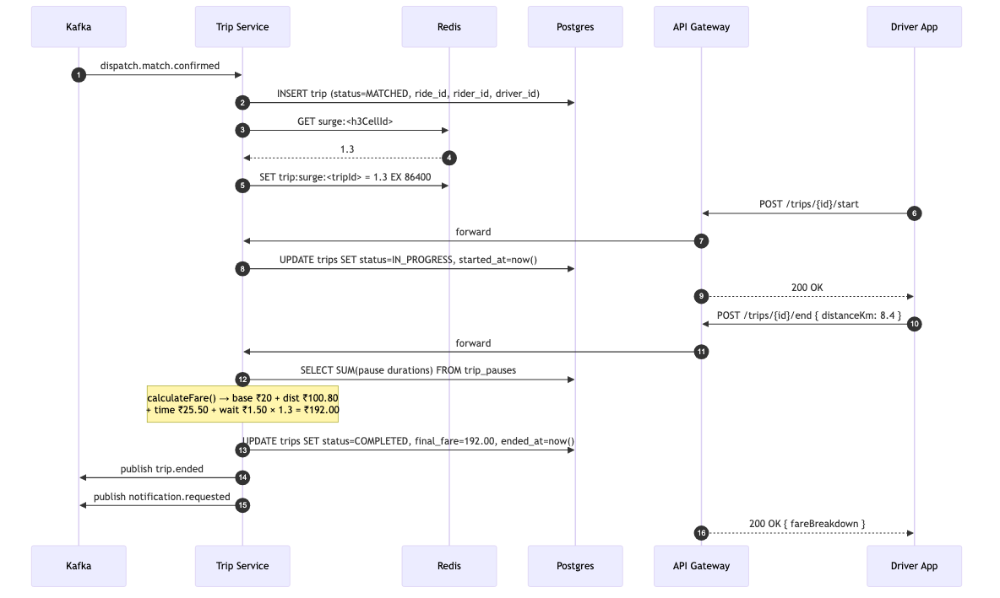
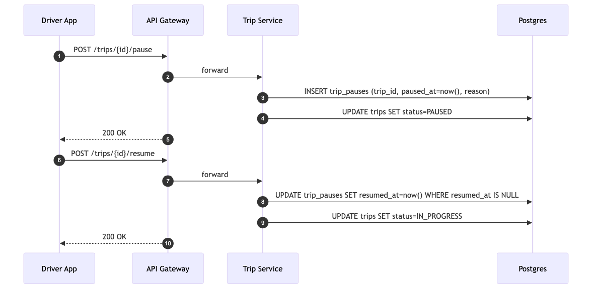
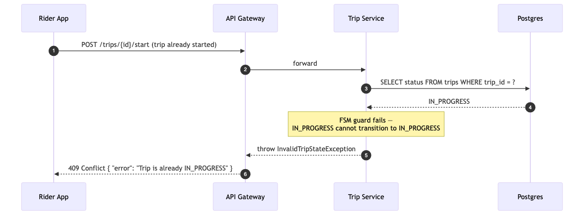
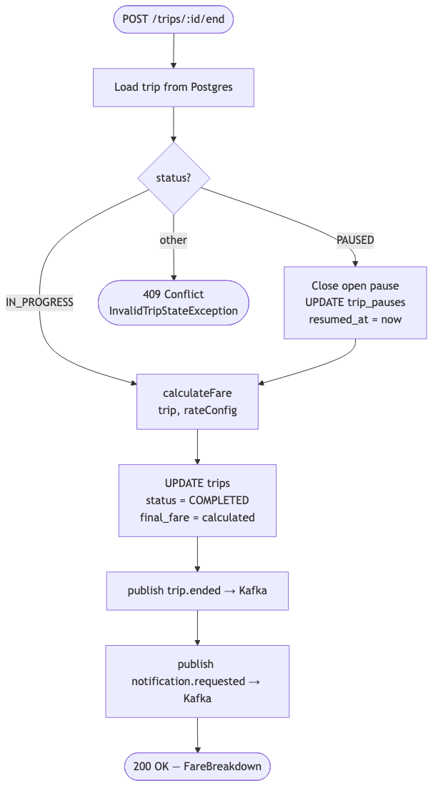

# LLD Trip — 03: Sequence Diagrams

## Flow 1 — Trip Created → Started → Ended (Happy Path)

---

## Flow 2 — Pause / Resume During Trip

---

## Flow 3 — Invalid State Transition (Guard)

---

## Flow 4 — FSM Decision at Trip End

