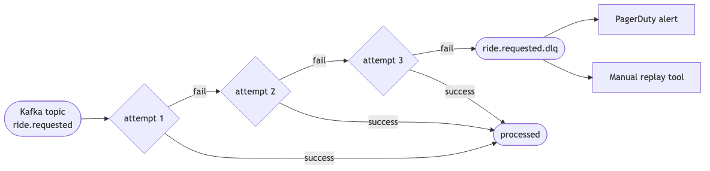
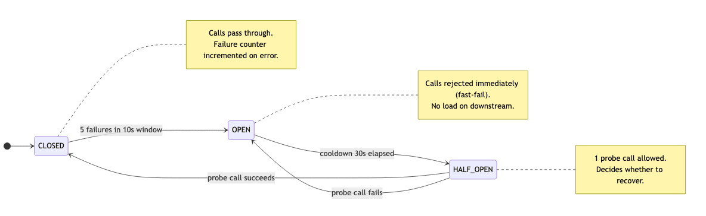
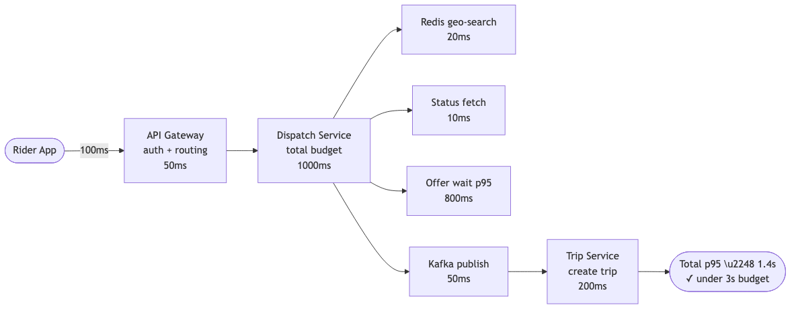
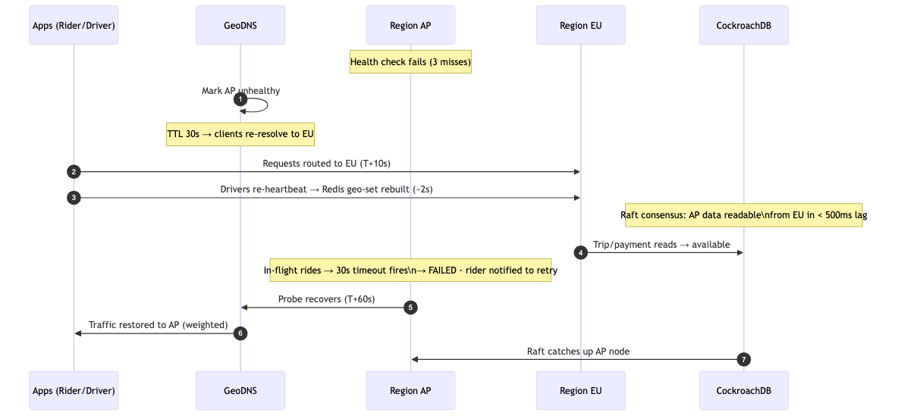
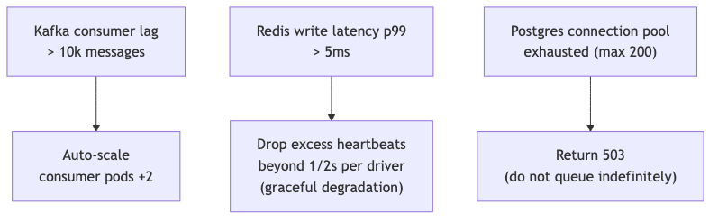

# D5 — Resilience Plan

> Covers failure modes relevant to 99.95% dispatch availability across multiple regions.

---

## 1. Retry Strategy (idempotent operations only)

| Service Boundary | Retry Policy | Max Attempts | Backoff |
|---|---|---|---|
| Rider App → API Gateway | Exponential, jittered | 3 | 100ms, 200ms, 400ms |
| API Gateway → Dispatch | Exponential, jittered | 2 | 50ms, 100ms |
| Kafka consumer → business logic | Retry topic (DLQ after 3 fails) | 3 | 500ms fixed |
| Dispatch → Redis (status CAS) | Inline retry | 2 | 10ms |
| Trip Service → Postgres | Exponential | 3 | 100ms, 300ms, 900ms |

**All API calls carry an idempotency key** (Idempotency-Key header).  
On retry the server returns the cached response — no duplicate dispatch.

---

## 2. Dead Letter Queue (DLQ) Handling

All 11 Kafka topics have a corresponding `.dlq` topic.  
DLQ messages include: original payload + failure reason + retry count.

---

## 3. Circuit Breaker

Applied at service-to-service HTTP calls (not for Kafka, which has its own backpressure).

Services with circuit breakers:
- Dispatch Service → Driver Read-Model (Redis fallback: reject new offers)
- Payment Service → PSP (async fallback: mark payment PENDING, retry via scheduler)
- Notification Service → Push Provider (fallback: SMS)

---

## 4. Bulkhead / Rate Limiting

| Boundary | Mechanism | Limit |
|---|---|---|
| POST /v1/rides (per rider) | Token bucket (Redis) | 5 req/min |
| POST /v1/rides (global) | Token bucket | 60k req/min |
| Driver location heartbeat | Throttle at gateway | max 2/s per driver |
| Kafka consumer | `max.poll.records` = 500 | per partition |

---

## 5. Timeout Budget

---

## 6. Multi-Region Failover

**Data guarantees during failover:**

| Storage | What happens | Recovery |
|---|---|---|
| CockroachDB | Raft consensus — data already replicated | Reads available from EU immediately |
| Kafka | At-least-once delivery resumes on broker recovery | Idempotency keys deduplicate redeliveries |
| Redis | Lost on region failure | Rebuilt from driver heartbeats within 2 heartbeat intervals (~2s) |

---

## 7. Backpressure

---

## 8. Failure Mode Catalogue

| Failure | Detection | Mitigation |
|---|---|---|
| Redis unavailable | Connection error | Dispatch returns 503; no geo-search fallback (accuracy required) |
| CockroachDB node down | Health check | Other nodes serve reads/writes (multi-master); auto-heal within 30s |
| Kafka broker down | Producer/consumer error | Retry + DLQ; at-least-once resumes on broker recovery |
| Driver app offline | No heartbeat 90s | DriverStateStore TTL expires; driver removed from supply |
| Duplicate ride request | Idempotency key | Redis NX + DB UNIQUE constraint; return cached response |
| Payment PSP timeout | HTTP timeout 5s | Circuit breaker OPEN; trip marked COMPLETED; payment async retry |
| Region network partition | Health probe miss | DNS failover to healthy region; in-flight requests retry via idempotency keys; CockroachDB Raft consensus ensures data durability |
| Surge multiplier stale (Redis key expired) | Key absent on read | Default multiplier = 1.0; no surge applied |
| **Dual-write: DB commit + Kafka publish** | Kafka broker unreachable after DB commit | Event silently dropped; trip state is correct in DB but downstream services (Payment, Notification) never notified. **Mitigation (production):** transactional outbox pattern — write event to an `outbox` table inside the same DB transaction; a dedicated relay reads the outbox and publishes to Kafka. Idempotency keys on consumers ensure safe re-delivery. |
